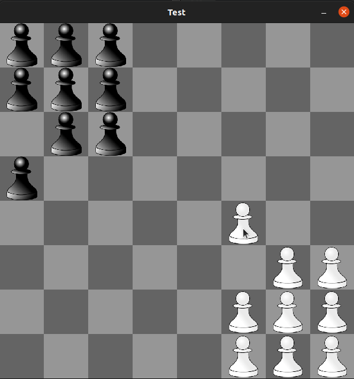

# Test

Суть игры:
После расстановки фигур на шахматной доске по очереди ходит игрок и AI. Во время
хода каждый может переместить одну фигуру. Фигуры можно перемещать только на
одну клетку (вверх, вниз, влево, вправо). В одну клетку можно поставить только одну
фигуру. Побеждает тот, кто первый расставит все свои фигуры на место фигур
противника.

## Зависимости
1. A C++20 compiler. Following compilers should work:
  * [gcc 10+](https://gcc.gnu.org/)

  * [clang 10+](https://clang.llvm.org/)
  
2. [CMake 2.8+](https://cmake.org/)

3. [SFML](https://www.sfml-dev.org/)

### Сборка
Пример сборки из билд директории:

 $ cmake --build . 
 $ make
